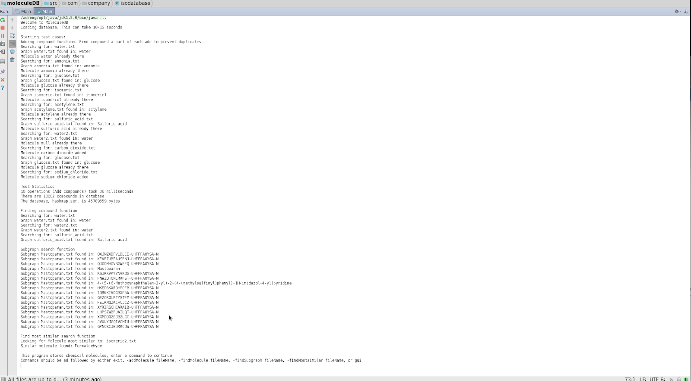
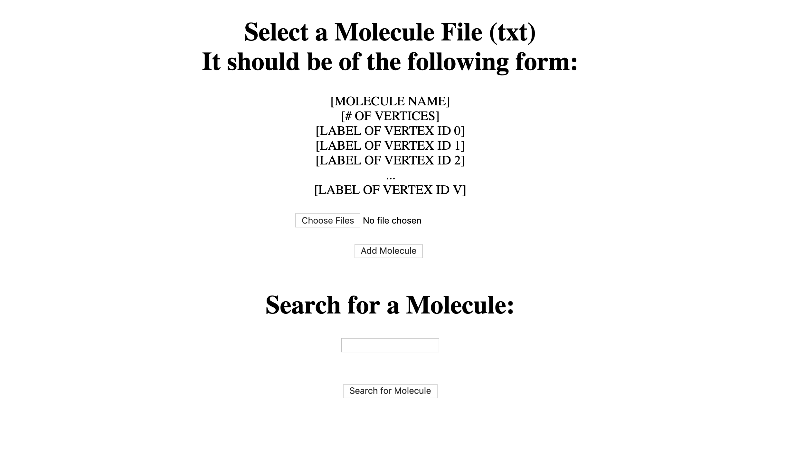
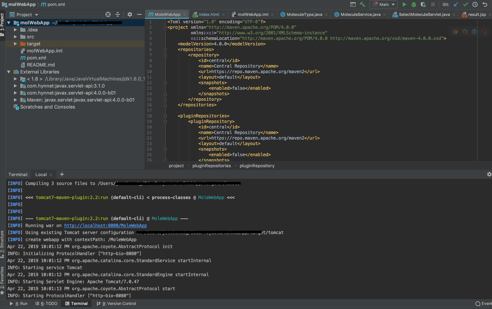

# EC504 MoleculeDB
# Final Project Implementation 
# MoleculeDB
# Team 8
The scope of our project was to build a molecule database. We had to write algorithms to add molecular compounds, as well as search via different molecule attributes. The database and associated functions currently account for isomorphic cases, accommodate 10 operations per second on a 10,000 molecule database, and use an integrated command-line-interface.
## Group Members:
* Matthew Hormis (mhomris@bu.edu)
* Eric Li (ericli21@bu.edu)
* David Payne (payneda@bu.edu)
* Andrew Stoycos (astoycos@bu.edu)
* Jacob Zweig (jpzweig@bu.edu)

## Basic Functionality 
### Overview
We store our molecules in a Hashmap data structure, chosen for quick add and access support features. Each key within the Hashmap is stored using a multigraph with each key-value pair stored in the database through a built-in “put” function. We have a pre-compiled database of 10,000 molecules (gathered from ChemSpider) stored on a Raspberry Pi as a serialized file, that the user can pre populate the hashmap from. If the user would like to start with a different dataset, they have to option to start from a local directory. We have written Java functions to add compounds, search for compounds, and perform a subgraph search (revealing which compounds contain a specific subgraph, used as an input parameter in the function). A user has the ability to interact with the database via a command-line-interface or graphical user interface (GUI).

Solving Isomorphism 
One of the hardest challenges in this project was solving graph isomorphism, when searching for molecules within our database.  Graph isomorphism occurs when a given Graph G1 has a one to one mapping of nodes to another Graph G2, i.e in our case when molecules have the same graph structure even then their text representation is different. In order to solve this problem we utilized a direct backtracking method to construct a search tree implemented in the custom class same_graph . To assist in the efficiency of this method we began by building our database such that pruning occurred prior to the actually Graph comparisons.  This pruning included matching the number of Atoms, number of Bonds and number of unique elements before the recursive algorithm is called with . Following initial pruning and early exit constraints the same_graph.check_SG()  which returns true if all the vertices of SG are mapped to vertices in G.  If not, or if one of the other pruning constraints were met, the function returns False. This implementation is great due to its early detection and quit abilities, optimized backtracking, and satisfaction of Neighbor Compatibility. As shown in the source 2. This algorithm is very efficient and overall has very similar performance to the advanced algorithms such as Ullman and VFT.  
The way we attempt to fix this issue of isomorphism is by using back-tracking in order to construct a search tree. We then look at each graph and explore several sequences of nodes that match each other. We backtrack if a branch does not return a valid solution.

## Additional Feature Implementation:
### Develop a stand-alone Graphical User Interface that provides molecular entry and search capabilities, database statistics, and also displays molecules in some reasonable graphic format.
The GUI is able to be called with the command ‘md gui.’ From there, the GUI provides access to three functions via buttons: to find a molecule, to add a molecule, and to see database statistics. For find and add, clicking those buttons opens up dialogs to select the relevant file from a user’s file system. The results of each action are then displayed in a confirmation box. Note: The GUI does not display molecules.
Key Decisions Made:
Swing framework - Chose to use ‘Swing’ due to prevalence of documentation and simplicity. The big downside considered was its aesthetics
No unique functions or data structures - The GUI calls functions, it does not have any algorithms unique to itself as that was considered to be wasteful and unnecessary  
### Run a server for your database than can be accessed through some reasonable interface over a socket port.
The MoleculeDB program, using a URLconnection socket, is able to access the database that is hosted on a raspberry pi based server through a port that is forwarded out of that local area network. The program has a preference for a local database and does all updating to a local copy
Key Decisions Made:
Uni-directional server access - the choice was made to make the server database read-only for two reasons. One, under the alternative of a read-write server, that would require version and collaboration-control to deal with simultaneous access, adding, or deleting by multiple users. That can be a very frustrating experience as anyone who’s dealt with collaborators they don’t know on a Google Docs or FosWiki can attest. Second, we wanted to ensure that the program could be run offline, once again, for convenience 
 Storage as .ser file - Given the complexity of the hashmap that we were using to get efficiency in searches, it would have been inefficient to translate that hashmap into text or a spreadsheet. We therefore chose to store the data using Java’s serializable file type as that is designed to store complicated data structures efficiently. The trade-off is that .ser files are not human-readable but a user can just open the program to search and get back a human readable name. 
### Download 1,000 known compounds from an existing database (e.g., [http://www.chemspider.com/AboutServices.aspx?][ChemSpider]]) into your molecular database.
Using the PubChem API and creating an HttpURLConnection object, we pulled the data in a JSON format by iterating through a for loop, increasing the “ID” of the call by one each time until reaching 1,000 compounds.
### Ability to search for the most similar molecule to a given molecule, under some reasonable graph similarity metric.
There are two main cases when determining molecule similarity (hashmaps and multigraphs are used):

The first case is if the input-molecule has the same chemical formula as a pre-existing molecule in the database, we enter the second layer of the hashmap and see if it also contains the same structure.
If so, we return the identical structure as found in the second layer of the hashmap.
If not, we return the first structure in the second layer of the hashmap, as this will represent the most similar chemical structure of the input-molecule.

The second case is if the input-molecule has a different chemical formula than any pre-existing molecules in the database, we see if there exists a compound with the same atoms as the input molecule.
If so, we return an arbitrary structure in the second layer of the hashmap, as this would be the most similar to the input-molecule.
If not, we do not declare any molecules as similar, as there would be a large percentage of pre-existing molecules as candidates for the most similar to the input-molecule.
### Implement subgraph search - finding all molecules(Gs) that contain a subgraph(SG) provided
To start we had to find all the Gs in the database that had a greater number of bonds, and atoms than the SG.  Also we had to ensure that each graph had the correct elements, i.e the elements in subgraph 
Then with the list of satisfactory graphs we used an instance of same_graph to call check_SG() and see if SG is a child of G using the recursive backtracking process described above. 
If same_graph.check_SG() returns true then the SG is a subgraph of Graph

### The following additional features have been removed from our Midterm Status Report:
#### Develop a web page and corresponding server-side executable for accessing the database.
Rationale for removal: Attempted to get web page but was unable to complete it due to inability to resolve the hooks from the webpage into the java program. Left the code in the folder to show work completed but did not integrate it into the program (using servlets and JSP).
Initially started with using Vaadin which is an open source Java framework for web development, but were experiencing problems with an upload feature.
#### Develop an Android client for your database
Rationale for removal: Given inability to get the web page to interact, we removed this feature as well since it would have relied upon solving the same problem
#### Implement approximate subgraph search
Rationale for removal: Ultimately determined that this was more complex than other features and when we were triaging features given limited time, we removed this feature. 

## References: 
* Kružel, Karol. “Effective Algorithms for Searching of Identical Molecules and Their Application.” MASARYK UNIVERSITY, 2008, pp. 8–11.
* Fu, Lixin, and Shruthi Chandra. “OPTIMIZED BACKTRACKING FOR SUBGRAPH ISOMORPHISM.” International Journal of Database Management Systems ( IJDMS ), Dec. 2012.
* *PubChem citation*

## Code:
All complete, working Java code used in your implementation.
All data needed by your project to run (or a simple, publicly accessible link thereto).
All testing code utilized to observe the correctness of your code.

## Work Breakdown
* Eric Li:
	- Most similar search function: look for 4 cases to find the most similar molecule given an input molecule file
	- Built the data structure framework (layered HashMap)
	- Made a class for molecular formula as a key to the first layer of the HashMap
* David Payne:
	- GUI - Built graphical user interface (GUI) and linked it with function calls addMolecule, findMolecule, and databaseStatistics. Wrote the database statistics function in isodatabase
	- Remote server - Set up a remote server for the database that can be accessed via port forwarding. As part of this, wrote logic in isodatabase that prioritizes a local database but will fetch the remote database stored on the RPi as a starter database
	- Wrote test cases for main and put in formatting for test cases
* Andrew Stoycos: 
	- Wrote command line interface 
	- Researched and implemented solution for Isomorphism problem, i.e same_graph class and all its methods 
	- Implemented add_Molecule() Method 
	- Implemented find_Molecule() Method
	- Researched and implemented findSubgraph() Method 
	- Wrote a bunch of Error catching constraints 
* Jacob Zweig: 
	- Worked on setting up a web-app to add and search for molecules (not implemented in final program)
    - Duplicate-handling in addMolecule()
    - Assisted in findCompound() searching by structure
* Matthew Hormis: 
	- Worked on setting up a web-app to add and search for molecules (not implemented in final program)
    - Assisted in findMostSimilar() when dealing with unknown molecules
# Jira links
Jira: https://agile.bu.edu/jira/projects/GROUP8/summary
Crucible: https://agile.bu.edu/crucible/cru/GROUP8-5
# Screenshot of Output

# Screenshots of WebApp
## Web App Interface

## Console Running WebApp with Tomcat

